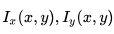
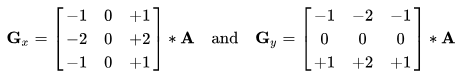
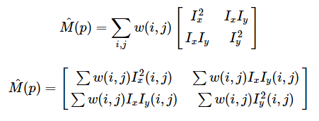
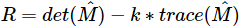
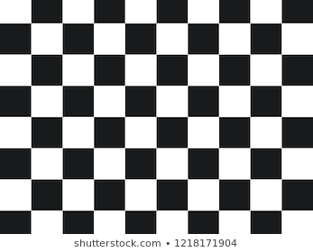
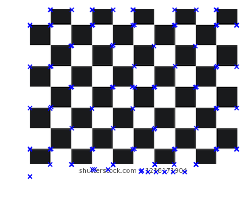
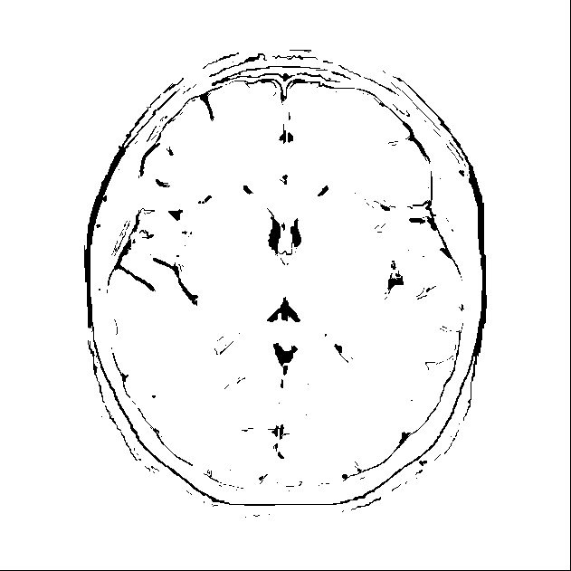
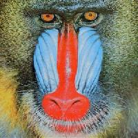
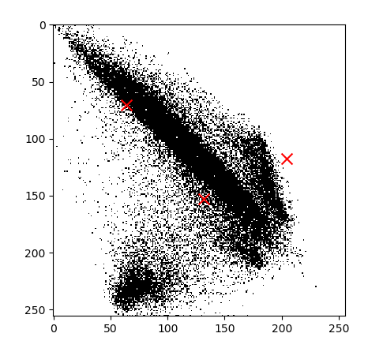
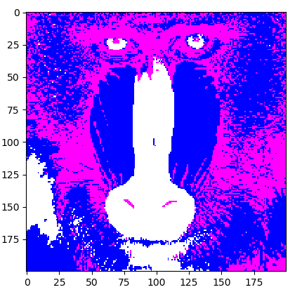

# Assignment 3:

# Corners Detection using Harris operator:

Harris Corner Detector is a corner detection operator that is commonly used in computer vision algorithms to extract corners and infer features of an image

## Steps: 

### 1- Color to grayscale
### 2- Spatial derivative calculation: 
   calculation of  of the image using Sobrl Kernel 
               
### 3- construct the Hessian matrix M over a window 1x1 so we are able to compute the principal vectors of variation.
   usage of box filter for the window and then construct the Hessian matrix M 

### 4- Harris response calculation 
               evaluate corners using R as a measure where 
   

### 5- Select large values of R using relative to quantile value
               corners = np.abs(R) > np.quantile(np.abs(R),0.9)
               

## Results:
  
### Input image 
  
                
### Output image 
                  
               

# Region (seed) Growing Segmentation:
 It is a simple region-based image segmentation method. It is also classified as a pixel-based image segmentation method since it involves the selection of initial seed points.
 
## Steps: 

### 1- Color to grayscale
### 2- Select a seed point
### 3- Usage of 8-connected neighborhood to grow from the seed points
### 4- The regions are then grown from these seed points to adjacent points depending on a region membership criterion. The criterion is pixel intensity
### 5- keep examining the adjacent pixels of seed points. If they have the same intensity value with the seed points, we classify them into the seed points

## Results:
  
### Input image 
  
                
### Output image 
  

# K means Clustering :

Input image :

to get clusters from this image 
First, we create the feature space by getting the red and the green value of each RGB pixel. It is 2d space as in this figure:

We generate random values of means then we cluster feature values according to the distances between them and the last means. we calculate the new mean for each cluster and redo the previous step to update these means ( X's are the mean values in the previous figure).
So, the user needs to determine the number of clusters and the number of iterations 

Finally, we cluster the pixels of the input image according to the final mean values and we give each cluster a random color 

output Image :  

#Mean Shift Segmentation
- it's an iterative method
- the feature space i calculated as 2*5 matrix
- the user has the ability to enter the threshold
- we set the convergence criterion (iter)
- selecting a random row from the feature space matrix and calculating it's mean to take it as initializing points
- calculating the Euclidean distance of all the other pixels in the feature space matrix
- comparing the Euclidean distance with the threshold and store these points in a list
if the value below the threshold
- calculating a new mean for each column of these points
- if the value of the new mean and the current mean less than the convergence criterion  the new mean is assigned to all the pixels in the image
### Difference between Input and Output image
with threshold = 90 and 200*200 image
- input image

- Output image

###References
[Github](https://github.com/agamdeep/Mean-Shift-Segmentation-using-Python)

[sbme-tutorials](https://sbme-tutorials.github.io/2019/cv/notes/6_week6.html#mean-shift-clustering)